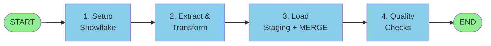

# BLS ETL Pipeline - Flowchart

## Pipeline Flow



---

## Step Details

### 1. Setup Snowflake
- Create Database & Schema (RAW)
- Create Table Structure (16 columns)

### 2. Extract & Transform
- Read CSV file
- Split occupation titles → separate job titles
- Clean & validate data

### 3. Load to Snowflake
- **Staging**: Load data in batches (1000 rows)
- **MERGE**: Upsert using `OCCUPATION_CODE + JOB_TITLE`
  - Update if exists
  - Insert if new

### 4. Quality Checks
- Count records, occupations, job titles
- Calculate wage statistics (min/max/avg)

---

## Key Features

🔄 **MERGE Pattern** - Prevents duplicates, handles updates  
📦 **Batch Processing** - 1000 rows at a time  
🔒 **Transactions** - BEGIN/COMMIT/ROLLBACK for safety  
✅ **Data Validation** - NULL handling, type checking

---

## Simple Flow Diagram

```
CSV File → Transform → Staging Table → MERGE → Main Table → Quality Check → Done
```

