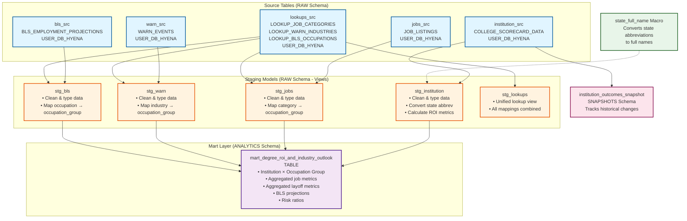

# dbt Project Data Flow

This document illustrates the data flow and transformations in the dbt warehouse project.

## Data Flow Diagram



## Detailed Transformation Flow

### 1. Source to Staging

#### Institution Data Flow
```
COLLEGE_SCORECARD_DATA
  ↓
stg_institution
  ├─ Clean & type conversion
  ├─ Apply state_full_name macro (abbrev → full name)
  ├─ Calculate ROI_IN_STATE
  ├─ Calculate ROI_OUT_OF_STATE
  ├─ Calculate DEBT_TO_EARNINGS_RATIO
  └─ Calculate VALUE_INDEX
```

#### Jobs Data Flow
```
JOB_LISTINGS
  ↓
stg_jobs
  ├─ Clean & type conversion (salary strings → numeric)
  └─ Join with LOOKUP_JOB_CATEGORIES
      └─ Map CATEGORY → OCCUPATION_GROUP
```

#### WARN Data Flow
```
WARN_EVENTS
  ↓
stg_warn
  ├─ Clean & type conversion (worker count strings → numeric)
  └─ Join with LOOKUP_WARN_INDUSTRIES
      └─ Map INDUSTRY → OCCUPATION_GROUP
```

#### BLS Data Flow
```
BLS_EMPLOYMENT_PROJECTIONS
  ↓
stg_bls
  ├─ Clean & type conversion (employment numbers → numeric)
  └─ Join with LOOKUP_BLS_OCCUPATIONS
      └─ Map OCCUPATION_TITLE → OCCUPATION_GROUP
```

### 2. Staging to Mart

```
stg_institution
  ├─ Extract unique institutions
  └─ Create institution dimension
      ↓
stg_jobs + stg_warn + stg_bls
  ├─ Extract unique OCCUPATION_GROUP values
  └─ Create occupation group dimension
      ↓
Cross Join: Institutions × Occupation Groups
  ↓
mart_degree_roi_and_industry_outlook
  ├─ Join institution metrics (ROI, debt, value)
  ├─ Join aggregated job metrics (count, avg salary)
  ├─ Join aggregated layoff metrics (total laid off)
  ├─ Join BLS projections (employment, growth, wages)
  └─ Calculate derived metrics (layoff-to-posting ratio)
```

### 3. Snapshot Process

```
COLLEGE_SCORECARD_DATA
  ↓
institution_outcomes_snapshot
  ├─ Strategy: Timestamp-based
  ├─ Unique Key: INSTITUTION_ID
  ├─ Updated At: LOAD_TIMESTAMP
  └─ Tracks: All institution fields over time
```

## Key Transformations

### Data Standardization
- **Occupation Groups**: All sources mapped to 25 standardized occupation groups
- **State Names**: State abbreviations converted to full names
- **Data Types**: String numbers converted to numeric types
- **Null Handling**: Coalesce operations for unmapped values

### Aggregations
- **Jobs**: Count and average salary by occupation group
- **WARN**: Sum of laid-off workers by occupation group
- **BLS**: Average employment, growth, and wages by occupation group

### Derived Metrics
- **ROI Calculations**: Earnings minus tuition costs
- **Debt Ratios**: Debt relative to earnings
- **Risk Ratios**: Layoffs relative to job postings
- **Value Index**: Earnings minus net price

## Schema Organization

```
RAW Schema (Staging)
├── stg_institution (VIEW)
├── stg_jobs (VIEW)
├── stg_warn (VIEW)
├── stg_bls (VIEW)
└── stg_lookups (VIEW)

ANALYTICS Schema (Marts)
└── mart_degree_roi_and_industry_outlook (TABLE)

SNAPSHOTS Schema
└── institution_outcomes_snapshot (TABLE)
```

## Execution Order

1. **Sources** are loaded by ETL pipelines (Airflow DAGs)
2. **Staging models** run in parallel (no dependencies between them)
3. **Mart model** runs after all staging models complete
4. **Snapshot** runs independently to track changes

## Dependencies

```
stg_institution → mart_degree_roi_and_industry_outlook
stg_jobs → mart_degree_roi_and_industry_outlook
stg_warn → mart_degree_roi_and_industry_outlook
stg_bls → mart_degree_roi_and_industry_outlook

lookups_src → stg_jobs, stg_warn, stg_bls, stg_lookups
state_full_name macro → stg_institution
```

